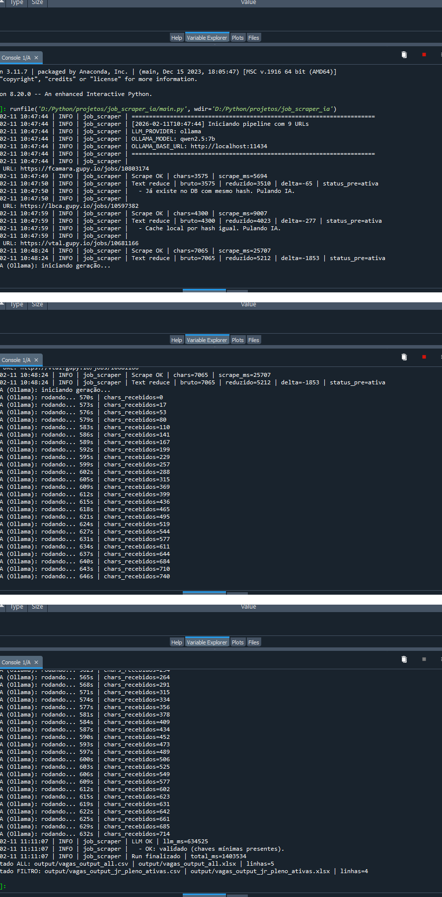
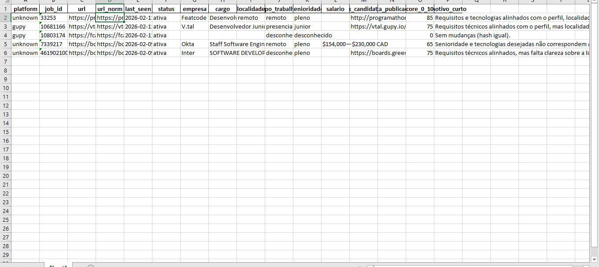

# Job Scraper IA (Python + Ollama + SQLite)

Pipeline local em Python para coletar vagas via URLs diretas, realizar scraping robusto com fallback, extrair campos estruturados usando LLM local (Ollama), deduplicar e persistir histórico em SQLite, com export automático para CSV e Excel (XLSX).

> Projeto focado em automação, backend e dados, com execução 100% local.

---

## 🎯 Objetivo

Automatizar a coleta e organização de vagas a partir de links diretos, gerando uma base histórica consultável e arquivos finais prontos para uso (CSV/XLSX).

---

## ✅ Features

- Coleta de vagas por **lista de URLs**
- Scraping robusto com **fallback**
- Extração estruturada com **IA local (Ollama)**
- Redução e limpeza de texto para otimizar custo/tempo de LLM
- Deduplicação e persistência de histórico em **SQLite**
- Export automático para:
  - CSV
  - Excel (.xlsx)
- Logs detalhados para auditoria e debug
- Arquitetura modular e pronta para expansão

---

## 🧠 Tecnologias e Competências

**Stack:**
- Python
- Web Scraping
- SQLite
- Data Processing
- Automação
- ETL (conceito)
- LLM local (Ollama)
- APIs
- Export CSV/XLSX

---

## 🖥️ Demo

> As imagens abaixo mostram o pipeline em execução e o output final gerado automaticamente.

### Execução (logs do pipeline)


### Output gerado (Excel)


---

## 🏗️ Arquitetura (Visão Geral)

O pipeline é organizado em etapas independentes, com foco em confiabilidade e reaproveitamento:

1. Entrada: lista de URLs de vagas  
2. Scraping + fallback (caso layout falhe)  
3. Redução de texto (limpeza e otimização)  
4. Extração estruturada com IA local (Ollama)  
5. Validação de chaves mínimas  
6. Deduplicação (hash) e persistência em SQLite  
7. Export automático para CSV e Excel  

---

## 📦 Estrutura do Projeto

```txt
job_scraper_ia/
├── main.py
├── config.json
├── db.py
├── export_db.py
├── output/
├── README.md
└── ...
```

---

## ▶️ Como executar (Windows)

### 1) Clonar o projeto
```bash
git clone https://github.com/flavioro/job_scraper_ia.git
cd job_scraper_ia
```

### 2) Criar ambiente virtual
```bash
python -m venv venv
venv\Scripts\activate
```

### 3) Instalar dependências
```bash
pip install -r requirements.txt
```

### 4) Rodar o Ollama localmente
- Instale o Ollama: https://ollama.com/
- Baixe um modelo (exemplo):
```bash
ollama pull qwen2.5:7b
```

### 5) Executar o pipeline
```bash
python main.py
```

---

## 📤 Saídas geradas

O projeto gera automaticamente arquivos no diretório `output/`, por exemplo:

- `output/vagas_output_all.csv`
- `output/vagas_output_all.xlsx`
- `output/vagas_output_jr_pleno_ativas.csv`
- `output/vagas_output_jr_pleno_ativas.xlsx`

---

## 🔍 Campos extraídos (exemplo)

O pipeline tenta estruturar campos como:

- Empresa
- Cargo
- Localidade / Remoto
- Tipo de trabalho (remoto / híbrido / presencial)
- Senioridade
- Salário (quando disponível)
- Link de candidatura
- Data da publicação
- Score (0 a 100)
- Motivo curto (feedback do match)

---

## 📌 Observações

- O projeto roda **100% local**, sem depender de API paga.
- A qualidade da extração pode variar conforme o layout e o texto da vaga.
- A arquitetura é preparada para adicionar novos sites/fontes facilmente.

---

## 🧩 Próximas melhorias (ideias)

- [ ] Dashboard (Streamlit) para visualizar e filtrar vagas
- [ ] Integração com mais fontes (Gupy, Workday, Lever, Greenhouse etc)
- [ ] Cache inteligente por domínio
- [ ] Scheduler (execução automática diária)
- [ ] Export com filtros personalizados

---

## 👤 Autor

**Flavio Rodrigues**  
LinkedIn: https://www.linkedin.com/in/flaviorobertorodrigues/  
GitHub: https://github.com/flavioro
